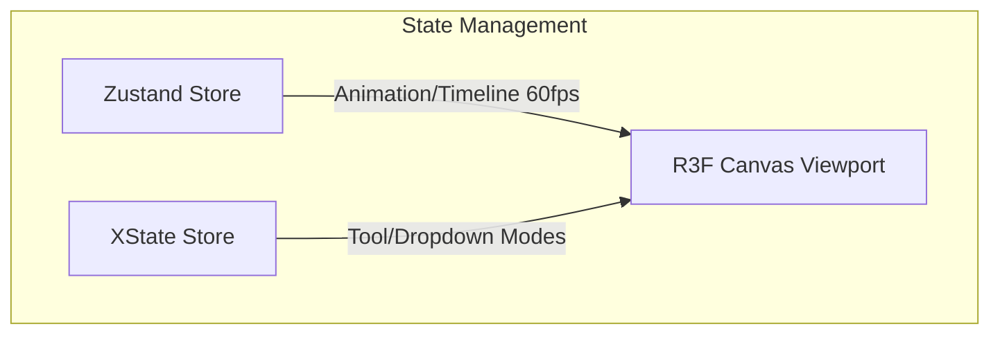

# Refactoring Plan: Viewport State via XState Store

We are refactoring the viewport interaction state (`interactionMode`, `transformMode`, and `activeDropdown`) from our Zustand store into a dedicated, high-performance, event-driven state container using `@xstate/store` and `@xstate/store-react`.

---

## 1. Hybrid State Architecture Design

To keep high-frequency animation ticking separate from user-interaction controls, we use:

1. **Zustand Store**: For project composition, layers, clips, keyframes, and the 60fps timeline scrub.
2. **XState Store**: For viewport interaction context:
   - `interactionMode` ("select" | "pan" | "orbit")
   - `transformMode` ("translate" | "rotate" | "scale")
   - `activeDropdown` ("select" | "cube" | "shape" | null)

---

## 2. Proposed Changes

### [NEW] [viewportStore.ts](file:///Users/channyeintun/Desktop/Motion-Graphics-Editor/src/editor/store/viewportStore.ts)

- Create `viewportStore` using `createStore` from `@xstate/store`.
- Define transition reducers for `setInteractionMode`, `setTransformMode`, and `setActiveDropdown`.

### [MODIFY] [editorStore.ts](file:///Users/channyeintun/Desktop/Motion-Graphics-Editor/src/editor/store/editorStore.ts)

- Remove `interactionMode`, `transformMode`, `setInteractionMode`, and `setTransformMode` types and implementations.

### [MODIFY] [PreviewViewport.tsx](file:///Users/channyeintun/Desktop/Motion-Graphics-Editor/src/editor/preview/PreviewViewport.tsx)

- Import `useSelector` from `@xstate/store-react` and `viewportStore` from `viewportStore.ts`.
- Read `interactionMode` via `useSelector`.

### [MODIFY] [AppShell.tsx](file:///Users/channyeintun/Desktop/Motion-Graphics-Editor/src/app/AppShell.tsx)

- Import `useSelector` from `@xstate/store-react` and `viewportStore` from `viewportStore.ts`.
- Read `interactionMode`, `transformMode`, and `activeDropdown` via `useSelector`.
- Dispatch mode changes via `viewportStore.send({ type: '...', ... })`.

---

## 3. Verification Plan

- Run `vp check` to ensure total type safety, formatting consistency, and lint compliance.
- Run `vp build` to build production bundle successfully.
